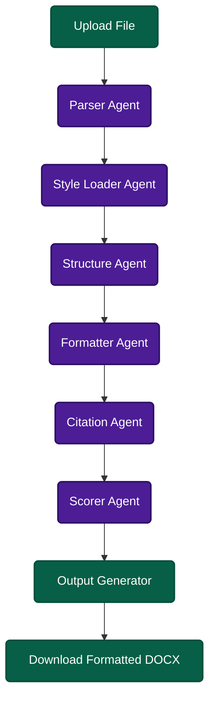

<div align="center">
  
  
  # 📝 Agent Paperpal (Manuscript Formatter)
  
  **An AI-powered, agentic manuscript formatting system that automatically styles your academic documents.**
  
  [](https://fastapi.tiangolo.com/)
  [](https://reactjs.org/)
  [](https://langchain-ai.github.io/langgraph/)
  [](https://ai.google.dev/)
</div>

<br/>

Agent Paperpal (also known as "Fix My Format") is an intelligent document processing pipeline that takes raw manuscripts and perfectly formats them according to standard academic style guides (APA 7th, MLA 9th, Chicago). By utilizing a multi-agent orchestration architecture powered by LangGraph, it breaks down the complex task of document formatting into specialized sub-tasks to guarantee accuracy, consistency, and a high compliance score.

---

## ✨ Features

- **🪄 Multi-Style Formatting**: Support for **APA 7**, **MLA 9**, and **Chicago** style guides.
- **📄 Extensible File Support**: Upload `.docx`, `.pdf`, or `.txt` manuscripts.
- **🤖 Agentic Pipeline**: A robust pipeline powered by LangGraph that handles parsing, structuring, formatting, citation checking, and scoring independently.
- **📊 Compliance Scoring**: Get a detailed compliance report and score for your formatted document based on the style rules.
- **🔗 Citation Validation**: Automatically matches in-text citations to the reference list, flagging missing or uncited references.
- **🌙 Beautiful UI**: A stunning, modern React frontend featuring drag-and-drop file uploads, dark mode, and smooth animations.
- **💾 Auto-Generate DOCX**: Downloads a perfectly formatted Microsoft Word `.docx` file immediately after processing.

---

## 🧠 Agent Workflow & Methodology

The core of Agent Paperpal is its autonomous multi-agent graph, orchestrated by **LangGraph**. The workflow passes a continuous `ManuscriptState` through a series of specialized nodes:



### The Agents

1. **Parser Node (`parser_agent.py`)**: Extracts raw text from the uploaded file (.docx, .pdf, or .txt).
2. **Style Loader Node (`style_agent.py`)**: Loads the strict JSON-based ruleset for the selected style guide (APA, MLA, or Chicago).
3. **Structure Node (`structure_agent.py`)**: Identifies heading levels, abstracts, body paragraphs, and references using a lightweight LLM pass.
4. **Formatter Node (`formatter_agent.py`)**: The heavy lifter—rewrites and readjusts structural elements to strictly match the loaded style rules.
5. **Citation Node (`citation_agent.py`)**: Cross-references every in-text citation against the works cited/reference list. Flags missing references and format errors.
6. **Scorer Node (`scorer_agent.py`)**: Evaluates the transformed manuscript against the strict style guide, generating a 0-100 `compliance_score` and a detailed breakdown.
7. **Output Node (`orchestrator.py`)**: Recompiles the formatted sections into a valid `.docx` buffer in memory.

---

## 🛠️ Technologies Used

### Frontend
- **React 19** & **Vite**: Blazing fast UI rendering and tooling.
- **Tailwind CSS v4**: Utility-first CSS for sleek, responsive styling.
- **Framer Motion**: For fluid UI transitions and micro-animations.
- **Lucide React**: Modern, scalable iconography.

### Backend
- **FastAPI**: High-performance asynchronous Python API.
- **LangGraph**: Framework for creating stateful, multi-actor LLM applications.
- **Google Generative AI (Gemini)**: Powers the intelligent reasoning inside the agents (specifically `gemini-3.1-flash-lite-preview`).
- **Python-docx / PyPDF2**: For robust document parsing and compilation.

---

## 🚀 Quick Start

### Prerequisites
- Node.js (v18+)
- Python (3.10+)
- A Google Gemini API Key.

### 1. Clone the Repository
```bash
git clone https://github.com/ParthZadeshwariya/manuscript-formatter.git
cd manuscript-formatter
```

### 2. Backend Setup
```bash
cd backend

# Create a virtual environment
python -m venv venv

# Activate the virtual environment
# On Windows:
venv\Scripts\activate
# On macOS/Linux:
source venv/bin/activate

# Install dependencies
pip install -r requirements.txt

# Setup Environment Variables
# Create a `.env` file inside the root directory and/or `backend/` and add your Gemini API key:
echo "GOOGLE_API_KEY=your_gemini_api_key_here" > .env

# Run the FastAPI server
uvicorn main:app --reload --port 8000
```
*The backend will be available at `http://localhost:8000`*

### 3. Frontend Setup
Open a new terminal window.
```bash
cd frontend

# Install dependencies
npm install

# Start the development server
npm run dev
```
*The frontend will be available at `http://localhost:5173`*

---

## 📖 Usage Guidelines

1. **Access the App**: Navigate to `http://localhost:5173` in your browser.
2. **Select Style Guide**: Choose your desired formatting style (APA 7, MLA 9, or Chicago) from the dropdown.
3. **Upload**: Drag and drop your manuscript (`.docx`, `.pdf`, or `.txt`) into the dropzone.
4. **Format**: Click "Format Manuscript". The agents will process your document in real-time.
5. **Review Results**: Once complete, view your **Compliance Score**, **Citation Report**, and **Formatting Logs** directly on the dashboard.
6. **Download**: Click the download button to save your newly formatted `.docx` file.

---

## 📄 License & Legal

This project is licensed under the MIT License. See the [LICENSE](LICENSE) file for details.

> **Disclaimer**: This tool uses AI to format documents. While the agents strive for high accuracy, users should always review formatted documents prior to final submission to ensure perfect compliance with academic standards.
